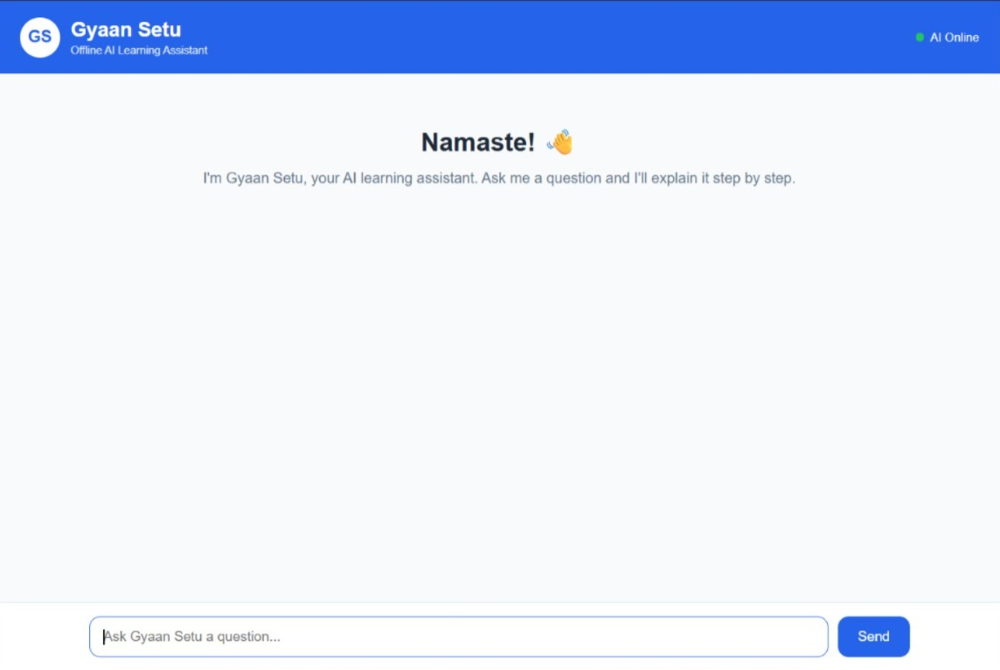
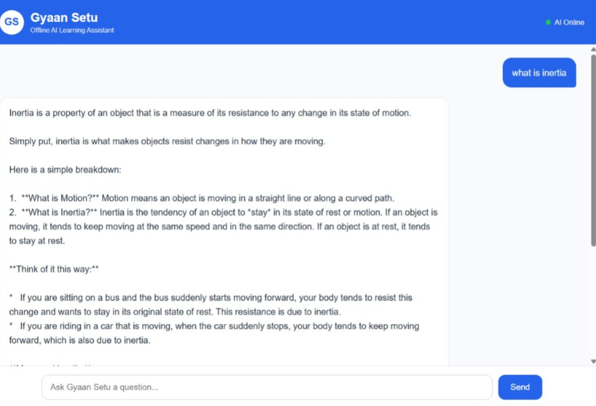
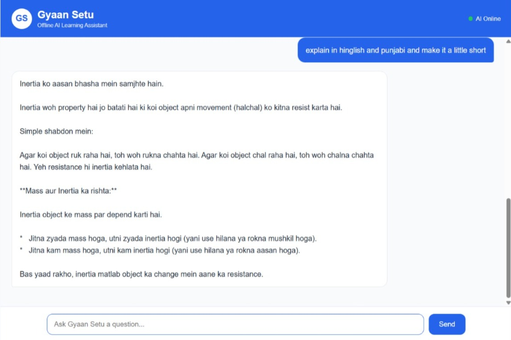

# Gyaan Setu 📚

### Offline AI Learning Assistant for Class 9 Students

Gyaan Setu is an AI-powered learning assistant designed to help Class 9 students understand concepts through simple, clear, and step-by-step explanations.

The project combines a web-based interface with a locally running AI system to create an interactive and accessible learning experience.

---

## 📸 Screenshots

### 🏠 Home



### 🤖 AI Tutor



### ⭐ Features



---

## ✨ Features

- 🤖 AI-powered learning assistant
- 📚 Designed for Class 9 students
- 🧠 Simple and step-by-step explanations
- 💬 Interactive conversational learning
- 🌐 Student-friendly web interface
- 🔒 Local AI processing using Ollama
- ⚡ Node.js and Express backend
- 🐍 Python-based AI components
- 🌍 Support for natural, student-friendly conversations

---

## 🛠️ Tech Stack

### Frontend

- HTML
- CSS
- JavaScript

### Backend

- Node.js
- Express.js
- Python
- FastAPI

### AI

- Ollama
- Locally hosted AI model

### Tools & Libraries

- REST API
- CORS
- dotenv
- npm

---

## 🏗️ System Architecture

```text
                    👨‍🎓 Student
                         │
                         ▼
              ┌────────────────────┐
              │   Gyaan Setu UI    │
              │  HTML / CSS / JS   │
              └─────────┬──────────┘
                        │
                        ▼
              ┌────────────────────┐
              │  Node.js / Express │
              │      Server        │
              └─────────┬──────────┘
                        │
                        ▼
              ┌────────────────────┐
              │ Python / AI Layer  │
              └─────────┬──────────┘
                        │
                        ▼
              ┌────────────────────┐
              │      Ollama        │
              │   Local AI Model   │
              └─────────┬──────────┘
                        │
                        ▼
              🧠 AI-generated response
                        │
                        ▼
                    👨‍🎓 Student